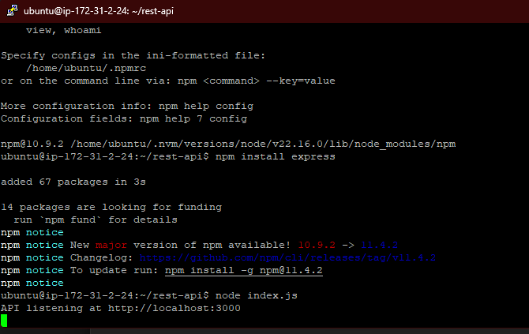

# Deploy a basic REST API using EC2 and Lambda in AWS.

In this assignment I used Amazon Web Services deploy a simple REST API using EC2 and AWS Lambda.

# Rest API in AWS EC2.
To beigin with this task you'll need an EC2 instance that you can get from the AWS Dashboard once you create your account.

## Launch an Instance
To launch an EC2 instance go to EC2 in your AWS Dashboard and click in 'Launch Instance'

Here I selected an Ubuntu virtual machine with a t2.micro type to be able to use the free tier.

In this same screen I create a key pair to be able to connect trough SSH using PuTTY.

## Setup
Once the instance was up and running I setup PuTTY to target the instance public dns by adding at the beginning `ubuntu@` then dns name.


Once this was setup I added my SSH key into the SSH tab and I was in my EC2 instance.


### Setup the REST API using Express
Once I was inside my EC2 instance I setup the server to run the API following these steps:

1. Install Node Version Manager
```bash
curl -o- https://raw.githubusercontent.com/nvm-sh/nvm/v0.39.7/install.sh | bash
```
2. Activate it
```bash
source ~/.bashrc
```

3. Installed the LST version of Node
```bash
nvm install --lts
```

4. Setup the project by creating a folder
```bash
mkdir rest-api && cd rest-api
```

5. Initialized the project using node
```bash
npm init -y
```

6. Installed Express
```bash
npm install express
```

7. Create a basic index.js containing the API
[index.js](index.js)

8. Transfer the file to the server using WinSCP


9. Run the API
```bash
node index.js
```


With this, the API was up and running inside the EC2 server and it exposed two endpoints
`/hello` and `/status` on the port 3000.

But to be able to access the port 3000 you'll need to allow it inside your EC2 instance dashboard under security.


## API Response
With the API now running in the EC2 instance and the port available I then was able to hit the endpoint to get a response by using the public ipv4 address of my instance and specifiying the port 3000.

### Response to /hello


### Response to /status


# REST API in AWS Lambda
Now for creating a REST API using Lambda you'll need to create a function, for this you'll need to go into the Lambda section in your AWS dashboard and click `creat function`

## Setup
Now to be able to access this lambda we first need to create a lambda function and then an API Gateway that servers as entry point / trigger to this function.


### Setup Lambda
1. Name your function in this case 'AWS-LAMBDA'
2. Select the run time in this case 'NODE.JS 22.x'
3. Create the code of the lambda. In this case its a simple response like this:
```JavaScript
export const handler = async (event, context) => {
  return {
    statusCode: 200,
    headers: { 'Content-Type': 'application/json' },
    body: JSON.stringify({ message: 'Hello from AWS Lambda!' }),
  };
};
```
4. Once setup click on deploy to save the changes

### Setup API Gateway
Now we need a way to access the lambda, to achieve this we can create an API Gateway to serve as a trigger, for this we go into AWS API Gateway and select `Create API`.
1. Now we select HTTP API
2. We select a name and an integration of type lambda, making sure it points at the lambda we just created.
3. We select the HTTP method type and path of the endpoint, for this we set a `GET` method and a path of `/lambda`.
4. We select our lambda target.
5. Once this is set up and running we now are able to test our API with our 'Invoke URL' and adding the paths.


## Calling the Lambda through the API
Now with the Lambda and API setup we are able to hit our lambda using the API URL and the endpoint we created like this:

And we get the response ''Hello from AWS Lambda!'